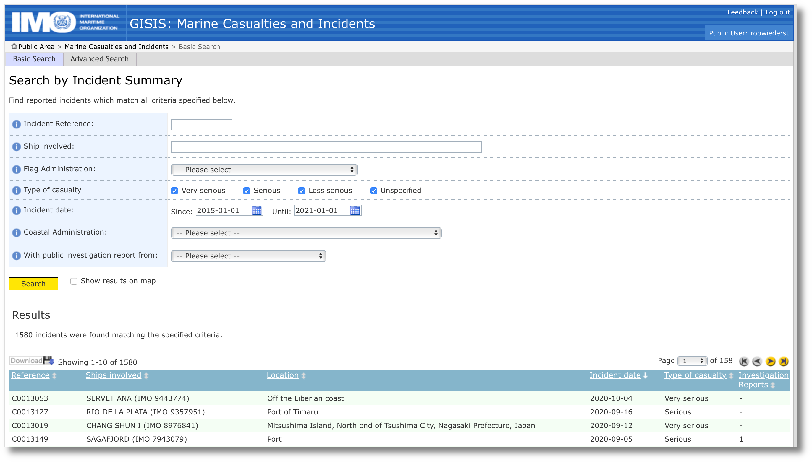

[International Maritime Organization](https://gisis.imo.org/Public/MCI/Search.aspx)

[Sample Data](data/raw/IMO-20210723-08105484.csv)

# [Background](#background)

From the IMO:

## Marine Casualties and Incidents

The casualty module contains two kinds of information collected on ship casualties. The first category of information is made of factual data collected from various sources and the second category of data is made of more elaborated information based on the reports of investigations into casualties received at IMO which may be full investigations reports to be analysed by the Organization or reporting forms annexed to MSC-MEPC.3/Circ.3.

## Classifications

For the purpose of collecting information on ship casualties to populate the GISIS casualty module, the Organization, selecting ship casualties according to the following classification: "very serious casualties", "serious casualties", "less serious casualties" and "marine incidents."

- "Very serious casualties" are casualties to ships which involve total loss of the ship, loss of life, or severe pollution, the definition of which, as agreed by the Marine Environment Protection Committee at its thirty-seventh session, is as follows:

 - "Severe pollution" is a case of pollution which, as evaluated by the coastal State(s) affected or the flag State, as appropriate, produces a major deleterious effect upon the environment, or which would have produced such an effect without preventive action.

- "Serious casualties" are casualties to ships which do not qualify as "very serious casualties" and which involve a fire, explosion, collision, grounding, contact, heavy weather damage, ice damage, hull cracking, or suspected hull defect, etc., resulting in:
immobilization of main engines, extensive accommodation damage, severe structural damage, such as penetration of the hull under water, etc., rendering the ship unfit to proceed*, or pollution (regardless of quantity); and/or a breakdown necessitating towage or shore assistance.

- "Less serious casualties" are casualties to ship which do not qualify as very serious casualties or serious casualties and for the purpose of recording useful information also include marine incidents which themselves include "hazardous incidents" and "near misses."

* The ship is in a condition, which does not correspond substantially with the applicable conventions, presenting a danger to the ship and the persons on board or an unreasonable threat of harm to the marine environment.

## Disclaimer

The GISIS casualty module contains information related to marine casualties and incidents as well as full marine safety investigation reports submitted to the International Maritime Organization by reporting Administrations. The module also contains analyses of these reports, which are aimed at identifying overall trends or issues of potential concern to the marine transportation (or to the shipping industry). No corroborating data is available and the analysis should not be used for any other purpose.The accuracy of the data available in this module cannot be guaranteed. Where appropriate, reference is made to relevant IMO instruments.
